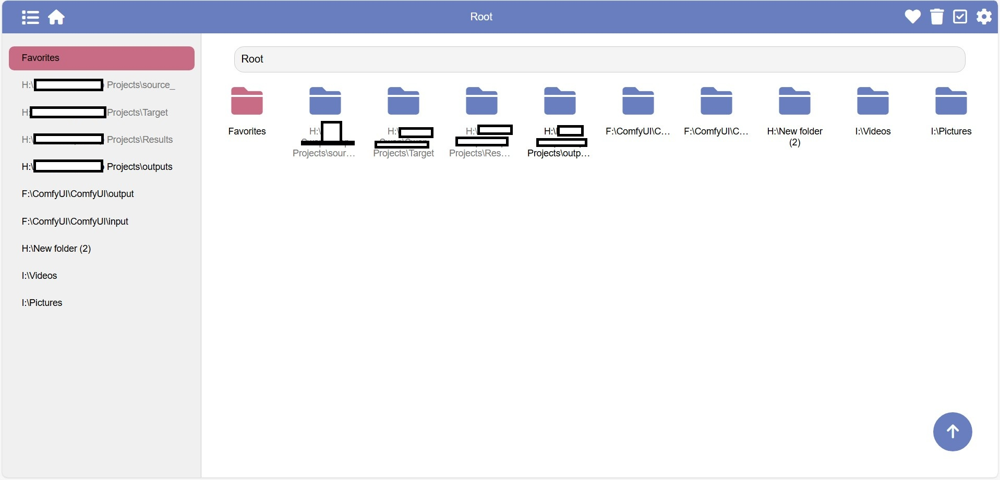
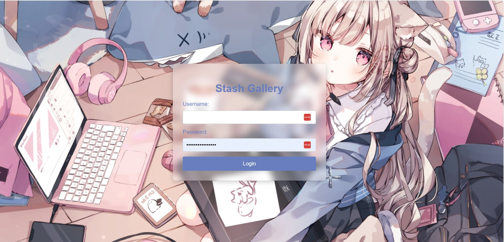

# Preview




# Features
1. Folder-style browsing with a masonry (waterfall) image layout and favorites support.
2. Folder-level read, favorite and delete flags.
3. Integration with Stash to favorite images and videos.
4. Simple login interface.
5. Mobile-friendly layout.
6. Docker deployment support.
7. Dedicated views for favorite images and favorite folders.

# Deployment
## 1. Deploy Stash
If you don't already have Stash deployed, see the upstream project: https://github.com/stashapp/stash

## 2. Get a Stash API key
Configure your Stash account credentials and generate an API key.

## 3. Run stash-folder-view
```
docker run --restart=always -v /app/data:/app/data -e base_url=[stash_url] -e jump_url=[stash_url] -e username=[username] -e password=[password] -e api_key=[stash_api] -p 8000:8000 -d unimrq/stash-folder-view
```

- `stash_url`: The address used to access Stash from the container. Keep the trailing `/`, e.g. "http://192.168.1.51:12001/"
- `jump_url`: The URL used for image links (optional). If empty, it defaults to `stash_url`.
- `username`: The username for stash-folder-view login (does not need to match Stash credentials).
- `password`: The password for stash-folder-view login (does not need to match Stash credentials).

# TODO
1. Improve floating button behaviors (done)
2. Show favorite button in masonry grid (done)
3. Display favorite files and folders on home (done)
4. Improve login flow (done)
5. Folder icon list view (done)
6. Auto-scroll and highlight current folder on the left (done)
7. Separate favorites page (done)
8. Favorite-folder view page (done)
9. Left navigation pinning (removed)
10. Collapse read folders in left nav (done)
11. Make breadcrumb scrollable horizontally
12. Change floating button to go up one level when returning to top